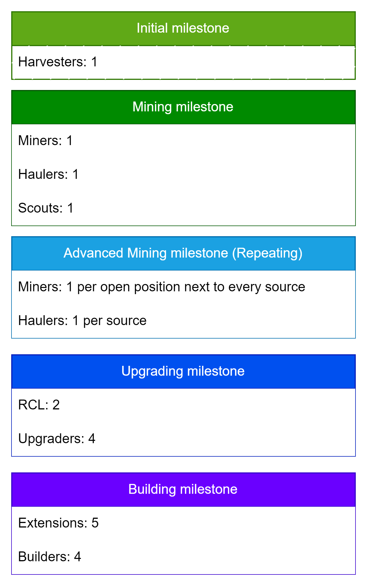

Last I worked on this;

I just made the services part of the room object. I have not made the interfaces all neat yet.
There might also be some null checks missing.

I access the services via room.owned.<serviceName> e.g. room.owned.creepManager

Something I still wanted to do was serialise the memory. The idea here is to deserialise the memory object at the start of each tick, and once once serialise it at the end of the tick. This way all memory writes are to the javascript heap, and not the in game memory object.

Then I need to start looking at automatic building. Ideally get to RCL2 in order to build spawns and roads.
For roads, still need to look into path caching.

Strategies

